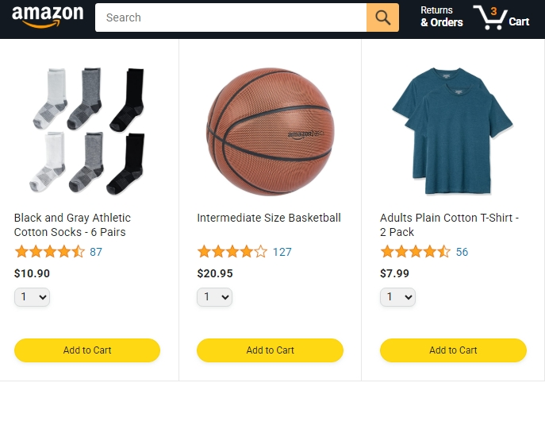
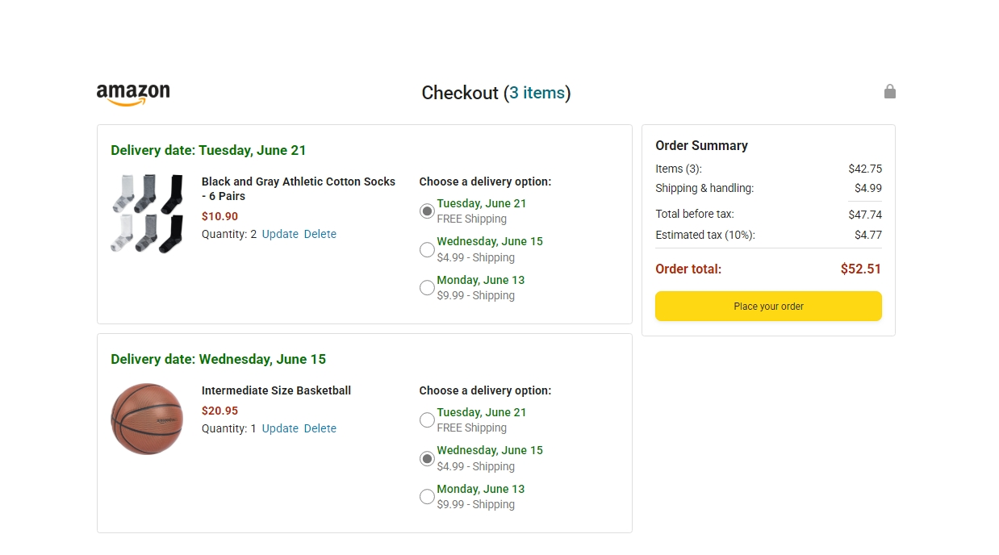
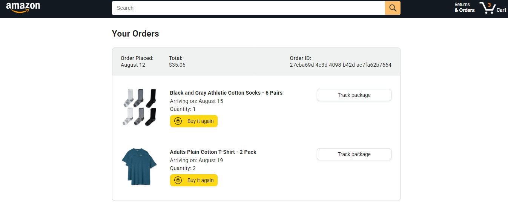

# **Amazon Clone** - E-commerce Platform  

A clone of Amazon's e-commerce website where users can browse products, add them to the cart, proceed to checkout, and track their orders.  

---

## **Key Features**  

### **For Users:**  
- **Browse Products**: Explore products across different categories.  
- **Add to Cart**: Add desired products to the shopping cart.  
- **Checkout Process**: Place orders and proceed with payments.  
- **Order Tracking**: Track the delivery status of purchased items.  

### **For Admins:**  
- **Manage Products**: Add and update products.  
- **Order Management**: Process and manage user orders and deliveries.  

---

## **Methodology**  
This project is built using **HTML, CSS, and JavaScript**. It follows a **Responsive Design** and is structured using a **Component-Based Architecture**.  

---

## **Tech Stack**  

### **Frontend:**  
- HTML  
- CSS  
- JavaScript  

### **Styling:**  
- Responsive Web Design  
- Flexbox & Grid  

---

## **Limitations**  
- This project is frontend-only, with no backend integration.  
- No payment gateway is included yet.  

---

## **Demonstration**  

This project showcases the core functionalities of an **E-commerce Website**.  

### **Screenshots**  

#### 1. Homepage  
  
The main page displaying available products.  

#### 2. Checkout Page  
  
The checkout page where users can review and place their orders.  

#### 3. Order Tracking  
  
The order tracking page displaying the current delivery status.  

---

## 🌟 **Support & Feedback**  

If you like this project, please consider giving it a ⭐️!  
Your feedback is highly appreciated and helps improve future updates.  

---

Thank you for your support! 😊  
